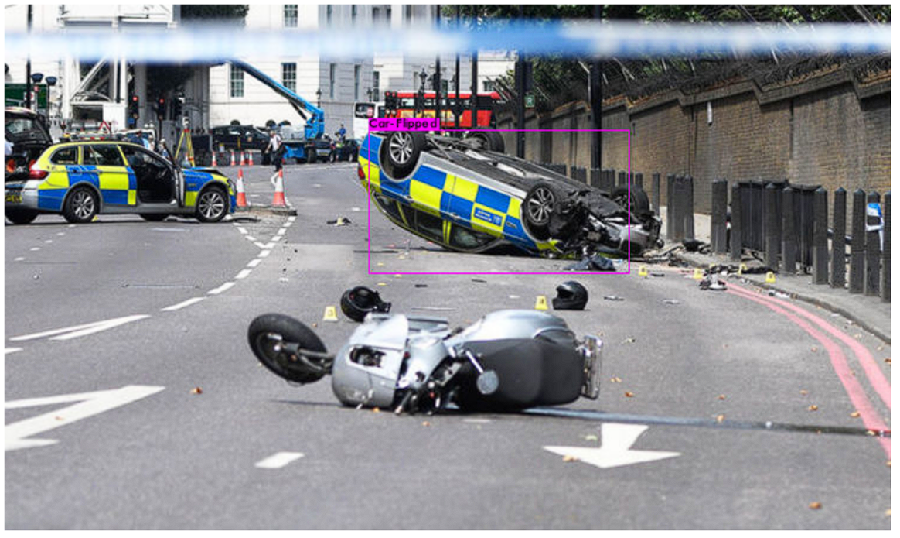
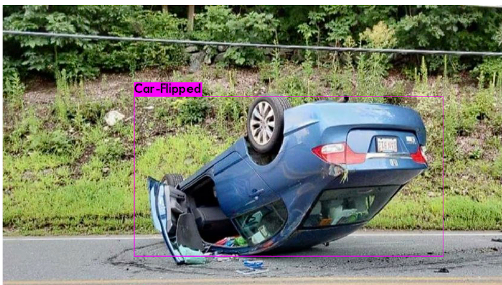
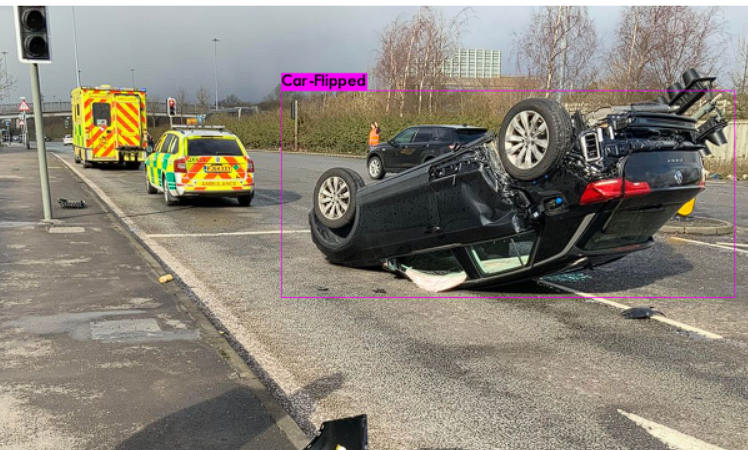
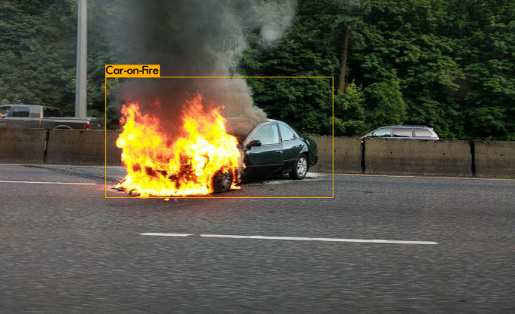

# Accident-Detection-Using-CNN-YOLOV3
In this project we are going to use YOLOV3 algorithm for accident detection on high-ways/roads in real-time.
It detects occurence of vehicle accidents using three classes namely- collision, flipping and fire in images and videos using YOLOV3 algorithm which is running on Darknet-53.

Results:

